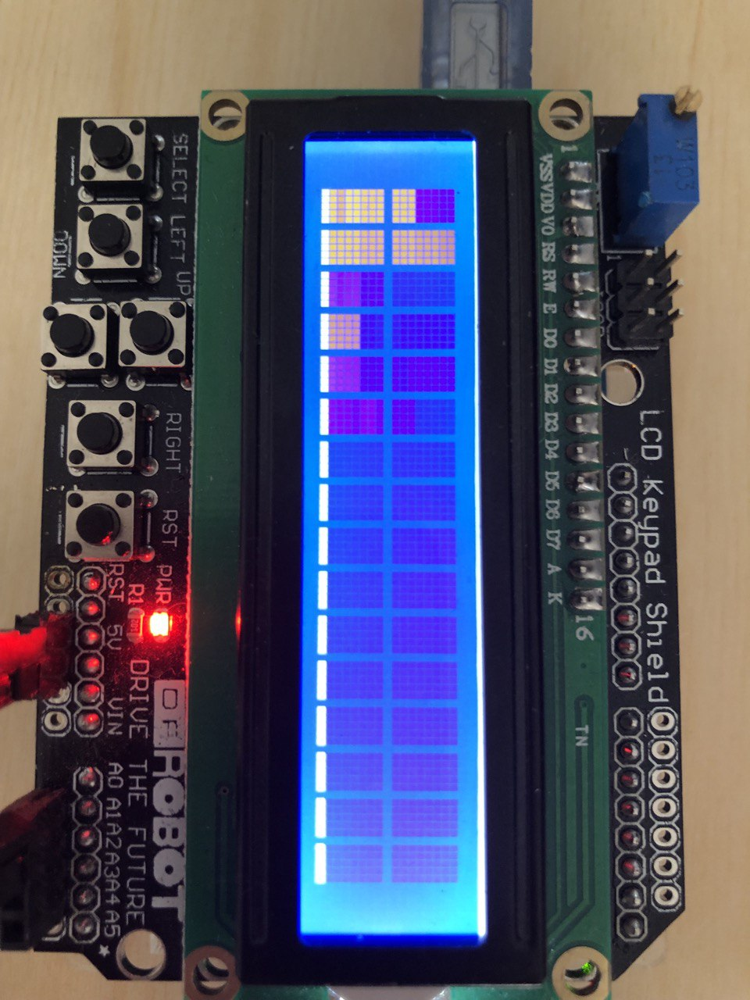
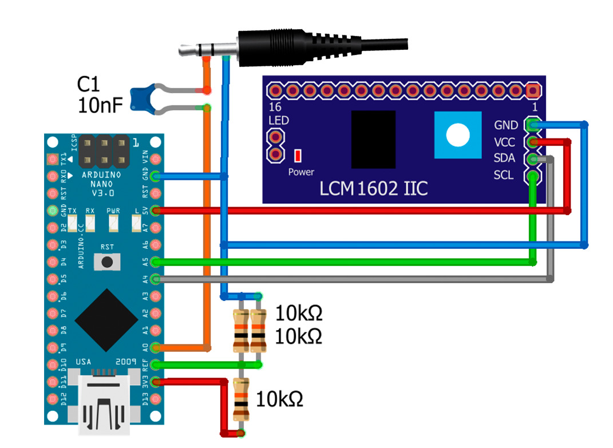

# Колонка-рафический анализатор аудио спектра на Arduino
* [Описание проекта](#chapter-0)
* [Папки проекта](#chapter-1)
* [Схема подключения](#chapter-2)
* [Материалы и компоненты](#chapter-3)
* [Как скачать и прошить](#chapter-4)
* [Зависимости](#chapter-5)

## Описание проекта
Графоанализатор спектра с кучей настроек и возможностей
- Вывод спектра на LCD дисплей 1602
- Настройка усиления и подавления шумов
- Настройка плавности анимации
- Настройка громкости:
  - Фиксированная
  - С потенциометра
  - Автоматическая
- Ручная выборка по частотам

## Папки
- **CAD** - содержит файлы CAD системы для дальнейшей печати на 3D принтере 
- **Project** - исходные коды, прошивка, мейкфайлы для сборки и документацию([инструкция](#chapter-4)) 
  - **Colonka** - исходые коды
  - **Doc** - дополнительная документация про провекту

## Схема

## Материалы и компоненты
* Arduino UNO – искать
* Макетная плата и провода
* Дисплей 1602
* LCD Keypad Shield
* Модуль микрофона

## Как скачать и прошить
* Скачать архив с проектом
* Установить библиотеки в  
`C:\Program Files (x86)\Arduino\libraries\` (Windows x64)  
`C:\Program Files\Arduino\libraries\` (Windows x86)
* Подключить Ардуино к компьютеру
* Настроить мейкфайлы: COM порт и модель Arduino можно узнать командой "make list"
* Настроить что нужно по проекту
* Загрузить прошивку: "make program"
* Пользоваться  

## Настройки в коде (пример для WS2812)

    // сигнал
    #define INPUT_GAIN 1.5    // коэффициент усиления входного сигнала
    #define LOW_PASS 35       // нижний порог чувствительности шумов (нет скачков при отсутствии звука)
    #define MAX_COEF 1.2      // коэффициент, который делает "максимальные" пики чуть меньше максимума, для более приятного восприятия
    #define NORMALIZE 0       // нормализовать пики (столбики низких и высоких частот будут одинаковой длины при одинаковой громкости) (1 вкл, 0 выкл)

    // анимация
    #define SMOOTH 0.3        // плавность движения столбиков (0 - 1)
    #define DELAY 4           // задержка между обновлениями матрицы (периодичность основного цикла), миллиисекунды

    // громкость
    #define DEF_GAIN 70       // максимальный порог по умолчанию (при MANUAL_GAIN или AUTO_GAIN игнорируется)
    #define MANUAL_GAIN 0     // ручная настройка потенциометром на громкость (1 вкл, 0 выкл)
    #define AUTO_GAIN 1       // автонастройка по громкости (экспериментальная функция) (1 вкл, 0 выкл)

    // массив тонов, расположены примерно по параболе. От 80 Гц до 16 кГц
    byte posOffset[17] = {2, 3, 4, 6, 8, 10, 12, 14, 16, 20, 25, 30, 35, 60, 80, 100, 120};

## Зависимости
- **FHT** - библиотека, содержащая быстрое преобразование Хартли, используется при получении спектра
- **LiquidCrystal** - библиотека для работы с LCD эканом
